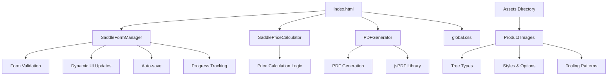
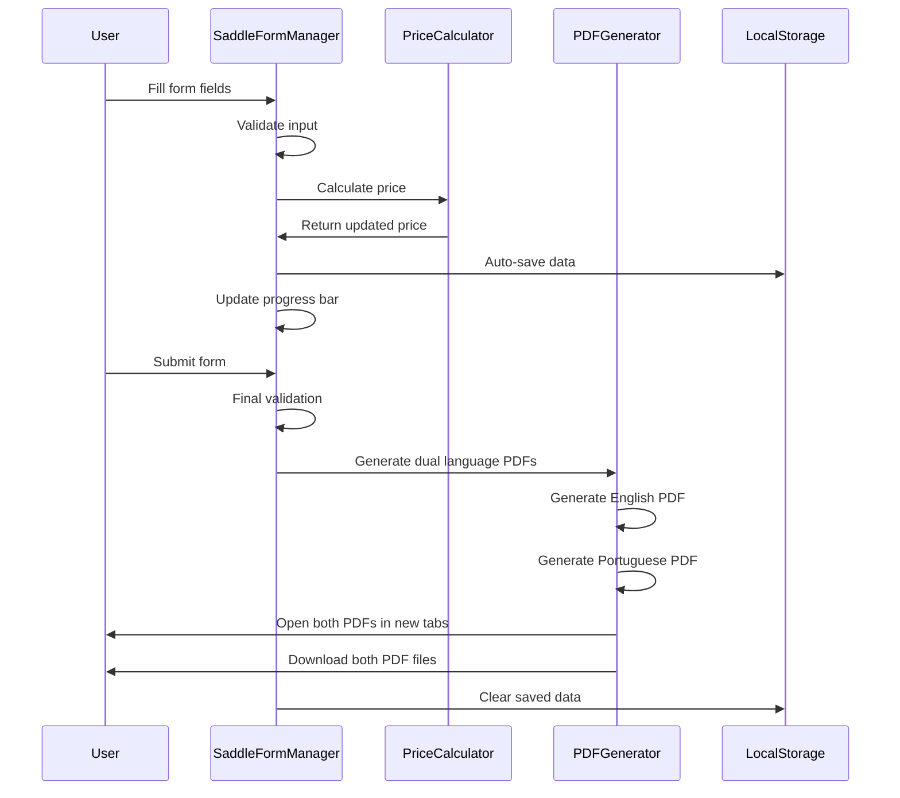

# Design Document

## Overview

O sistema de pedidos de selas Tomahawk é uma aplicação web single-page que utiliza JavaScript vanilla com jQuery para gerenciar um formulário complexo e interativo. O sistema é composto por três módulos principais: gerenciamento de formulário, cálculo de preços e geração de PDF. A arquitetura é baseada em classes ES6 para organização e manutenibilidade do código.

## Architecture

### Client-Side Architecture



### Data Flow



## Components and Interfaces

### SaddleFormManager Class

**Responsabilidades:**
- Gerenciamento de estado do formulário
- Validação de campos obrigatórios
- Controle de visibilidade de seções dinâmicas
- Auto-save e recuperação de dados
- Integração com calculadora de preços

**Principais Métodos:**
```javascript
class SaddleFormManager {
    constructor()
    init()
    setupEventListeners()
    handleSaddleBuildChange(saddleBuild)
    handleSeatStyleChange(seatStyle)
    handleRiggingOptions(saddleBuild)
    validateForm()
    updateProgress()
    saveFormData()
    loadSavedData()
    generatePDF()
}
```

**Interface de Dados:**
```javascript
{
    saddleBuild: string,
    seatStyle: string,
    accessoriesGroup: array,
    // ... outros campos do formulário
}
```

### SaddlePriceCalculator Class

**Responsabilidades:**
- Cálculo dinâmico de preços baseado nas seleções
- Aplicação de modificadores de preço
- Manutenção da tabela de preços

**Estrutura de Preços:**
```javascript
modifiers: {
    saddleBuild: {
        'Full Leather': 2399,
        'Hybrid': 1799,
        'Full Neoprene': 1500
    },
    seatStyle: {
        'Inlay': 50
    },
    accessoriesGroup: {
        'Saddle String 4 or 6': 20,
        'Rig Guard': 25
    }
}
```

### PDFGenerator Class

**Responsabilidades:**
- Geração de PDF formatado com dados do pedido
- Estruturação de layout profissional
- Integração com biblioteca jsPDF
- Suporte a múltiplos idiomas (inglês e português)
- Geração simultânea de PDFs em ambos os idiomas

**Principais Métodos:**
```javascript
class PDFGenerator {
    constructor(doc, $form, language = 'en')
    generate()
    generateDualLanguage()
    setLanguage(language)
    getTranslation(key)
    generateFileName(language)
    // ... outros métodos existentes
}
```

**Sistema de Tradução:**
```javascript
translations: {
    en: {
        title: "TOMAHAWK BARREL SADDLE",
        subtitle: "Custom Saddle Order Form",
        customerInfo: "CUSTOMER INFORMATION",
        saddleSpecs: "SADDLE SPECIFICATIONS",
        // ... outras traduções
    },
    pt: {
        title: "SELA TOMAHAWK BARREL",
        subtitle: "Formulário de Pedido de Sela Personalizada",
        customerInfo: "INFORMAÇÕES DO CLIENTE",
        saddleSpecs: "ESPECIFICAÇÕES DA SELA",
        // ... outras traduções
    }
}
```

**Seções do PDF:**
1. Header com informações da empresa
2. Informações do cliente
3. Especificações da sela
4. Design e customização
5. Opções de tooling
6. Forro e rigging
7. Acessórios
8. Pagamento e envio
9. Footer

### Dynamic UI System

**Conditional Display Logic:**
- Seções específicas aparecem baseadas no tipo de construção selecionado
- Opções de rigging são filtradas por compatibilidade
- Campos de entrada customizada aparecem quando "other" é selecionado
- Opções de cores são desabilitadas para certos estilos de assento

**Visual Feedback:**
- Elementos desabilitados recebem opacity reduzida
- Seleções são destacadas visualmente
- Barra de progresso atualiza em tempo real
- Notificações aparecem para ações importantes

## Data Models

### FormData Model
```javascript
{
    // Customer Information
    customerName: string,
    phone: string,
    email: string,
    address: string,
    
    // Saddle Specifications
    seatSize: string,
    treeType: string,
    gulletSize: string,
    gulletOther: string,
    saddleBuild: string,
    style: string,
    
    // Design & Customization
    skirtStyle: string,
    cantleStyle: string,
    fenderStyle: string,
    jockeySeat: string,
    seatStyle: string,
    seatOptions: string,
    
    // Tooling Options
    tooledCoverage: string,
    leatherColorRoughout: string,
    leatherColorSmooth: string,
    leatherColorTooled: string,
    toolingPatternFloral: string,
    toolingPatternGeometric: string,
    toolingPatternBorder: string,
    
    // Lining & Rigging
    liningType: string,
    riggingStyle: string,
    
    // Accessories
    accessoriesGroup: array,
    buckstitching: string,
    buckStitchColor: string,
    backCinch: string,
    stirrups: string,
    backSkirt: string,
    conchos: string,
    specialNotes: string,
    
    // Payment & Pricing
    price: number,
    deposit: number,
    balanceDue: number,
    shippingMethod: string,
    paymentMethod: string,
    otherPaymentMethod: string
}
```

### Asset Structure Model
```
imgs/
├── 00-TreeType/
│   ├── 01-SafeTree/
│   ├── 02-BearTrap/
│   ├── 03-Performance/
│   └── 04-Classic/
├── 01-SaddleBuild/
├── 02-Hybrid/
├── 03-SkirtStyle/
├── 04-CantleStyle/
├── 05-FendersStyle/
├── 06-JockeySeat/
├── 07-Seat Style/
├── 08-SeatOptions/
├── 09-ToolingCover/
├── 10-PlainParts/
├── 11-TooledParts/
├── 12-GeneralTooling/
├── 13-BorderTooling/
├── 14-LiningType/
├── 15-RiggingStyle/
├── 16-AcessoriesOptions/
├── 17-BuckStitchingStyle/
├── 18-BackCinchOptions/
├── 19-StirrupsOptions/
├── 20-BackSkirt/
└── 21-Conchos/

assets/
└── translations.json
```

## Error Handling

### Form Validation
- **Required Field Validation:** Campos obrigatórios são verificados antes do envio
- **Format Validation:** Email e telefone são validados quanto ao formato
- **Radio Button Groups:** Verificação de que pelo menos uma opção foi selecionada em grupos obrigatórios

### User Feedback
- **Visual Indicators:** Campos inválidos recebem destaque visual
- **Notification System:** Mensagens de sucesso, erro e informação
- **Scroll to Error:** Foco automático no primeiro campo com erro

### Data Persistence
- **Auto-save Recovery:** Dados são recuperados automaticamente em caso de recarga da página
- **Storage Cleanup:** LocalStorage é limpo após envio bem-sucedido
- **Error Recovery:** Sistema continua funcionando mesmo se auto-save falhar

## Testing Strategy

### Unit Testing
- **SaddlePriceCalculator:** Testes para todos os cenários de cálculo de preço
- **Form Validation:** Testes para validação de campos obrigatórios e formatos
- **Dynamic UI Logic:** Testes para mostrar/ocultar seções baseadas em seleções

### Integration Testing
- **Form Submission Flow:** Teste completo do fluxo de preenchimento até geração de PDF
- **Auto-save Functionality:** Teste de salvamento e recuperação de dados
- **Price Calculation Integration:** Teste de atualização de preços em tempo real

### User Acceptance Testing
- **Cross-browser Compatibility:** Teste em diferentes navegadores
- **Responsive Design:** Teste em diferentes tamanhos de tela
- **PDF Generation:** Verificação de formatação e conteúdo do PDF gerado
- **Performance:** Teste de responsividade com formulário complexo

### Test Data Scenarios
- **Minimum Configuration:** Apenas campos obrigatórios preenchidos
- **Maximum Configuration:** Todos os campos e opções selecionados
- **Edge Cases:** Valores customizados, combinações específicas de opções
- **Error Scenarios:** Campos inválidos, falhas de rede, storage indisponível